# 🎥 Live Streaming Platform

[](https://opensource.org/licenses/MIT)
[](https://golang.org)
[](https://python.org)
[](https://fastapi.tiangolo.com)
[](https://kubernetes.io)
[](https://aws.amazon.com)

> A high-performance, scalable live streaming platform built with microservices architecture, supporting real-time streaming, chat, and analytics for millions of concurrent users.

## 📋 Table of Contents

- [🎯 Overview](#-overview)
- [✨ Features](#-features)
- [🏗️ Architecture](#️-architecture)
- [🛠️ Technology Stack](#️-technology-stack)
- [🚀 Quick Start](#-quick-start)
- [📁 Project Structure](#-project-structure)
- [🔧 Development](#-development)
- [🌐 API Documentation](#-api-documentation)
- [📊 Monitoring](#-monitoring)
- [🚀 Deployment](#-deployment)
- [🤝 Contributing](#-contributing)
- [📄 License](#-license)

## 🎯 Overview

This live streaming platform is a **Twitch-like** application that enables users to broadcast live content to millions of viewers with real-time chat interaction. Built using modern microservices architecture with **Go** and **Python**, deployed on **Kubernetes** and **AWS**.

### 🎯 Key Objectives

- **Sub-3 second latency** for live streaming
- **Millions of concurrent viewers** support
- **Real-time chat** with moderation
- **Global CDN** delivery
- **Horizontal scalability**
- **High availability** (99.99% uptime)

## ✨ Features

### 🎬 Live Streaming
- **RTMP Ingestion** from OBS, XSplit, and other streaming software
- **Adaptive Bitrate Streaming** (240p to 4K)
- **Global CDN Delivery** via AWS CloudFront
- **Stream Health Monitoring** with auto-recovery
- **Multi-quality Transcoding** in real-time

### 💬 Real-time Chat
- **WebSocket Connections** for instant messaging
- **Chat Moderation** with AI-powered spam detection
- **Emotes and Reactions** system
- **Subscriber-only Mode** and slow mode options
- **Real-time Message Broadcasting**

### 👥 User Management
- **JWT-based Authentication**
- **Streamer/Viewer Roles**
- **Follow/Subscribe System**
- **Stream Key Management**
- **User Profiles and Preferences**

### 📊 Analytics & Insights
- **Real-time Viewership Tracking**
- **Engagement Metrics** (chat rate, watch time)
- **Revenue Analytics** (donations, subscriptions)
- **Geographic Distribution**
- **ML-powered Recommendations**

### 💰 Monetization
- **Subscription Tiers**
- **Real-time Donations**
- **Virtual Gifts System**
- **Revenue Tracking**

## 🏗️ Architecture

### High-Level System Architecture


### Microservices Architecture


### Data Flow Diagram

```mermaid
sequenceDiagram
    participant Streamer as 🎥 Streamer (OBS)
    participant Viewer as 👤 Viewer
    participant LB as Load Balancer
    participant SMS as Stream Service
    participant US as User Service
    participant CS as Chat Service
    participant AS as Analytics Service
    participant CDN as CloudFront CDN
    participant DB as Database
    
    %% Streaming Flow
    Streamer->>LB: RTMP Stream
    LB->>SMS: Route Stream
    SMS->>US: Validate Stream Key
    US->>DB: Check User/Key
    US-->>SMS: Auth Success
    SMS->>CDN: Publish Stream
    
    %% Viewer Flow
    Viewer->>LB: Request Stream
    LB->>SMS: Get Stream URL
    SMS->>CDN: Generate Signed URL
    SMS-->>Viewer: Stream URL
    Viewer->>CDN: Watch Stream
    
    %% Chat Flow
    Viewer->>CS: Send Chat Message
    CS->>US: Validate User
    US-->>CS: User Valid
    CS->>AS: Track Message
    CS-->>Viewer: Broadcast Message
    
    %% Analytics Flow
    SMS->>AS: Stream Started
    CS->>AS: Chat Activity
    AS->>DB: Store Metrics
```



## 🛠️ Technology Stack

### **Programming Languages**
- **Go 1.21+** - High-performance streaming and chat services
- **Python 3.11+** - User management and analytics with FastAPI

### **Frameworks & Libraries**

#### Go Services
- **gRPC** - Inter-service communication
- **Gorilla WebSocket** - Real-time chat connections
- **Gin** - HTTP router (health checks)
- **Redis Client** - Caching and session management
- **AWS SDK** - AWS service integration

#### Python Services
- **FastAPI** - Modern web framework with automatic OpenAPI docs
- **Pydantic** - Data validation and settings management
- **SQLAlchemy** - Database ORM
- **Alembic** - Database migrations
- **Uvicorn** - ASGI server
- **grpcio** - gRPC Python implementation

### **Infrastructure & Cloud**

#### Container Orchestration
- **Kubernetes 1.28+** - Container orchestration
- **Docker** - Containerization
- **Helm** - Kubernetes package manager

#### AWS Services
- **EKS** - Managed Kubernetes service
- **DynamoDB** - NoSQL database for user data and streams
- **ElastiCache (Redis)** - In-memory caching and sessions
- **S3** - Object storage for video thumbnails and assets
- **CloudFront** - Global CDN for content delivery
- **Kinesis Video Streams** - Live video ingestion
- **Kinesis Data Streams** - Real-time analytics data
- **Elemental MediaLive** - Live video transcoding
- **Elemental MediaPackage** - Video packaging and origin
- **Application Load Balancer** - Load balancing
- **CloudWatch** - Monitoring and logging

### **Communication Protocols**
- **gRPC** - Synchronous inter-service communication
- **WebSocket** - Real-time chat messaging
- **RTMP** - Live stream ingestion from streaming software
- **HLS/DASH** - Adaptive bitrate streaming to viewers

### **Databases & Caching**
- **DynamoDB** - Primary database for user profiles, streams, chat logs
- **Redis (ElastiCache)** - Session storage, real-time counters, chat cache
- **S3** - Object storage for video assets and thumbnails

### **Monitoring & Observability**
- **Prometheus** - Metrics collection
- **Grafana** - Dashboards and visualization
- **Jaeger** - Distributed tracing
- **CloudWatch** - AWS native monitoring
- **Structured Logging** - JSON logging with correlation IDs

### **DevOps & CI/CD**
- **GitHub Actions** - CI/CD pipelines
- **Terraform** - Infrastructure as Code
- **Docker** - Containerization
- **Helm** - Kubernetes deployments
- **ArgoCD** - GitOps deployments (optional)

## 🚀 Quick Start

### Prerequisites
- **Docker & Docker Compose**
- **Go 1.21+**
- **Python 3.11+**
- **Node.js 18+** (for frontend development)
- **kubectl** (for Kubernetes deployment)
- **AWS CLI** (for cloud deployment)

### 1. Clone the Repository
```bash
git clone https://github.com/your-org/live-streaming-platform.git
cd live-streaming-platform
```

### 2. Environment Setup
```bash
# Copy environment template
cp .env.example .env

# Edit environment variables
nano .env
```

### 3. Local Development with Docker Compose
```bash
# Start all services locally
docker-compose up -d

# View logs
docker-compose logs -f

# Stop services
docker-compose down
```

### 4. Generate Protocol Buffers
```bash
# Generate Go and Python code from protobuf definitions
make proto
```

### 5. Run Individual Services

#### Stream Management Service (Go)
```bash
cd services/stream-management-service
go mod download
go run cmd/server/main.go
```

#### User Service (Python)
```bash
cd services/user-service
pip install -r requirements/dev.txt
uvicorn app.main:app --reload --port 8002
```

#### Chat Service (Go)
```bash
cd services/chat-service
go mod download
go run cmd/server/main.go
```

#### Analytics Service (Python)
```bash
cd services/analytics-service
pip install -r requirements/dev.txt
uvicorn app.main:app --reload --port 8004
```

### 6. Test the Services
```bash
# Health check all services
curl http://localhost:8001/health  # Stream Management
curl http://localhost:8002/health  # User Service
curl http://localhost:8003/health  # Chat Service
curl http://localhost:8004/health  # Analytics Service
```

## 📁 Project Structure

```
live-streaming-platform/
├── 📁 services/                    # Microservices
│   ├── 📁 stream-management-service/  # Go - RTMP ingestion & stream management
│   ├── 📁 user-service/               # Python - Authentication & user management
│   ├── 📁 chat-service/               # Go - Real-time chat & WebSocket
│   └── 📁 analytics-service/          # Python - Analytics & ML recommendations
├── 📁 proto/                       # Shared Protocol Buffer definitions
├── 📁 shared/                      # Shared libraries (Go & Python)
├── 📁 infrastructure/              # Infrastructure as Code (Terraform)
├── 📁 k8s/                        # Kubernetes manifests
├── 📁 helm/                       # Helm charts for deployment
├── 📁 scripts/                    # Build & deployment scripts
├── 📁 docs/                       # Documentation
├── 📁 monitoring/                 # Prometheus, Grafana configurations
├── 📁 tests/                      # Integration & E2E tests
└── 📁 tools/                      # Development utilities
```

### Service Responsibilities

| Service | Language | Port | Responsibilities |
|---------|----------|------|-----------------|
| **Stream Management** | Go | 8001 | RTMP ingestion, stream validation, health monitoring |
| **User Service** | Python | 8002 | Authentication, profiles, stream keys, subscriptions |
| **Chat Service** | Go | 8003 | Real-time chat, WebSocket connections, moderation |
| **Analytics Service** | Python | 8004 | Event tracking, ML recommendations, reporting |

## 🔧 Development

### Development Workflow

1. **Feature Development**
   ```bash
   # Create feature branch
   git checkout -b feature/new-chat-feature
   
   # Make changes
   # ...
   
   # Run tests
   make test
   
   # Commit and push
   git commit -m "feat: add new chat feature"
   git push origin feature/new-chat-feature
   ```

2. **Protocol Buffer Changes**
   ```bash
   # After modifying .proto files
   make proto
   
   # Commit generated code
   git add proto/generated/
   git commit -m "proto: update user service definitions"
   ```

3. **Local Testing**
   ```bash
   # Run unit tests
   make test
   
   # Run integration tests
   make test-integration
   
   # Run load tests
   make test-load
   ```

### Code Style & Standards

#### Go Services
- Follow **Go conventions** and **gofmt** formatting
- Use **structured logging** with correlation IDs
- Implement **graceful shutdown** for all services
- **Error handling** with proper gRPC status codes

#### Python Services
- Follow **PEP 8** style guide
- Use **type hints** for all functions
- **Pydantic models** for data validation
- **FastAPI dependency injection** for shared resources

### Adding New Features

1. **Define Protocol Buffers** in `proto/`
2. **Generate code** with `make proto`
3. **Implement service logic** in respective service
4. **Add tests** in service test directories
5. **Update documentation** in `docs/`

## 🌐 API Documentation

### REST APIs (FastAPI Services)

#### User Service - `http://localhost:8002`
- **Swagger UI**: http://localhost:8002/docs
- **ReDoc**: http://localhost:8002/redoc

#### Analytics Service - `http://localhost:8004`
- **Swagger UI**: http://localhost:8004/docs
- **ReDoc**: http://localhost:8004/redoc

### gRPC APIs

All services expose gRPC APIs defined in `proto/` directory:

#### Key Endpoints

**Stream Management Service** (Port 8001)
```protobuf
service StreamManagementService {
  rpc StartStream(StartStreamRequest) returns (StartStreamResponse);
  rpc StopStream(StopStreamRequest) returns (StopStreamResponse);
  rpc GetStreamStatus(StreamStatusRequest) returns (StreamStatusResponse);
}
```

**User Service** (Port 8002)
```protobuf
service UserService {
  rpc AuthenticateUser(AuthRequest) returns (AuthResponse);
  rpc GetUserProfile(UserProfileRequest) returns (UserProfileResponse);
  rpc ValidateStreamKey(ValidateStreamKeyRequest) returns (ValidateStreamKeyResponse);
}
```

**Chat Service** (Port 8003)
```protobuf
service ChatService {
  rpc JoinChatRoom(JoinChatRequest) returns (JoinChatResponse);
  rpc SendMessage(SendMessageRequest) returns (SendMessageResponse);
  rpc ModerateMessage(ModerateMessageRequest) returns (ModerateMessageResponse);
}
```

**Analytics Service** (Port 8004)
```protobuf
service AnalyticsService {
  rpc TrackStreamStart(StreamStartEvent) returns (TrackResponse);
  rpc GetStreamAnalytics(StreamAnalyticsRequest) returns (StreamAnalyticsResponse);
  rpc GetUserAnalytics(UserAnalyticsRequest) returns (UserAnalyticsResponse);
}
```

### WebSocket APIs

**Chat WebSocket** - `ws://localhost:8003/ws`
```json
// Join chat room
{
  "type": "join",
  "room_id": "stream_12345",
  "token": "jwt_token_here"
}

// Send message
{
  "type": "message",
  "content": "Hello everyone!",
  "room_id": "stream_12345"
}

// Receive message
{
  "type": "message",
  "user": "streamer123",
  "content": "Welcome to the stream!",
  "timestamp": "2024-01-15T10:30:00Z"
}
```

## 📊 Monitoring

### Metrics & Dashboards

#### Prometheus Metrics
- **Request Rate**: Requests per second for each service
- **Response Time**: P50, P95, P99 latencies
- **Error Rate**: 4xx and 5xx error percentages
- **Resource Usage**: CPU, Memory, Network I/O
- **Business Metrics**: Active streams, concurrent viewers, chat messages/sec

#### Grafana Dashboards
- **System Overview**: High-level platform health
- **Service Metrics**: Per-service performance
- **Business KPIs**: Streaming and user engagement metrics
- **Infrastructure**: Kubernetes cluster health

#### Custom Metrics
```go
// Go service metrics
streamGauge := prometheus.NewGaugeVec(
    prometheus.GaugeOpts{
        Name: "active_streams_total",
        Help: "Number of currently active streams",
    },
    []string{"quality"},
)
```

```python
# Python service metrics
from prometheus_client import Counter, Histogram

request_count = Counter(
    'http_requests_total', 
    'Total HTTP requests', 
    ['method', 'endpoint', 'status']
)
```

### Health Checks

All services implement comprehensive health checks:

```bash
# Kubernetes readiness/liveness probes
curl http://service:8000/health/live    # Liveness probe
curl http://service:8000/health/ready   # Readiness probe
```

### Logging

Structured JSON logging with correlation IDs:

```json
{
  "timestamp": "2024-01-15T10:30:00Z",
  "level": "info",
  "service": "user-service",
  "correlation_id": "req-12345",
  "user_id": "user-67890",
  "message": "User authenticated successfully",
  "duration_ms": 45
}
```

## 🚀 Deployment

### Local Development
```bash
# Start with Docker Compose
docker-compose up -d
```

### Kubernetes Deployment

#### Development Environment
```bash
# Apply namespace
kubectl apply -f k8s/namespaces/development.yml

# Deploy with Helm
helm upgrade --install live-streaming ./helm \
  -f helm/values-dev.yaml \
  --namespace live-streaming-dev
```

#### Production Environment
```bash
# Apply namespace
kubectl apply -f k8s/namespaces/production.yml

# Deploy with Helm
helm upgrade --install live-streaming ./helm \
  -f helm/values-prod.yaml \
  --namespace live-streaming-prod
```

### AWS Infrastructure Setup

#### Prerequisites
1. **AWS CLI** configured with appropriate permissions
2. **Terraform** installed
3. **EKS cluster** access configured

#### Deploy Infrastructure
```bash
cd infrastructure/terraform

# Initialize Terraform
terraform init

# Plan deployment
terraform plan -var-file="environments/prod/terraform.tfvars"

# Apply infrastructure
terraform apply -var-file="environments/prod/terraform.tfvars"
```

#### Configure EKS
```bash
# Update kubeconfig
aws eks update-kubeconfig --name live-streaming-cluster --region us-west-2

# Verify access
kubectl get nodes
```

### CI/CD Pipeline

GitHub Actions automatically:
1. **Runs tests** on pull requests
2. **Builds Docker images** on merge to main
3. **Deploys to staging** automatically
4. **Promotes to production** with manual approval

### Scaling Configuration

#### Horizontal Pod Autoscaler (HPA)
```yaml
# Automatic scaling based on CPU/Memory
apiVersion: autoscaling/v2
kind: HorizontalPodAutoscaler
metadata:
  name: chat-service-hpa
spec:
  scaleTargetRef:
    apiVersion: apps/v1
    kind: Deployment
    name: chat-service
  minReplicas: 3
  maxReplicas: 50
  metrics:
  - type: Resource
    resource:
      name: cpu
      target:
        type: Utilization
        averageUtilization: 70
```

## 🤝 Contributing

We welcome contributions! Please see our [Contributing Guide](CONTRIBUTING.md) for details.

### Development Setup
1. Fork the repository
2. Create a feature branch
3. Make your changes
4. Add tests
5. Ensure all tests pass
6. Submit a pull request

### Code Review Process
1. All code must be reviewed by at least 2 team members
2. All tests must pass
3. Code coverage must be maintained above 80%
4. Documentation must be updated for new features

### Reporting Issues
- Use GitHub Issues for bug reports
- Include detailed reproduction steps
- Provide logs and error messages
- Specify environment details

## 📄 License

This project is licensed under the MIT License - see the [LICENSE](LICENSE) file for details.

---

## 📞 Support & Contact

- **Documentation**: [docs/](./docs/)
- **Issues**: [GitHub Issues](https://github.com/your-org/live-streaming-platform/issues)
- **Discussions**: [GitHub Discussions](https://github.com/your-org/live-streaming-platform/discussions)
- **Email**: support@your-streaming-platform.com

---

## 🎯 Roadmap

### Phase 1 (Current) ✅
- [x] Core streaming infrastructure
- [x] Real-time chat system
- [x] User authentication
- [x] Basic analytics

### Phase 2 (In Progress) 🚧
- [ ] Mobile app support
- [ ] Advanced moderation tools
- [ ] Subscription payments
- [ ] Enhanced recommendations

### Phase 3 (Planned) 📋
- [ ] Multi-language support
- [ ] Advanced analytics dashboard
- [ ] Third-party integrations
- [ ] White-label solutions

---

**Built with ❤️ by the Live Streaming Platform Team**